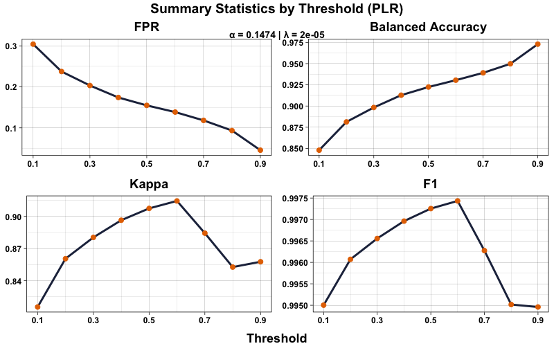
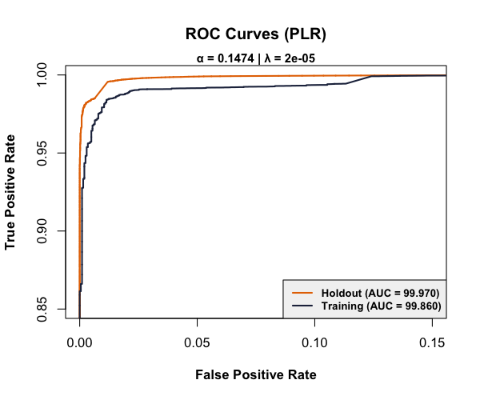

<p align="center">
  
</p>

<p align="center">
  
  <a href="https://opensource.org/licenses/MIT"></a>
  
</p>

---

## Overview

Classification models trained on satellite imagery to locate displaced persons sheltering under blue tarps after the 2010 Haiti earthquake. Seven algorithms — Logistic Regression, LDA, QDA, KNN, Penalized Logistic Regression (Elastic Net), Random Forest, and SVM — are tuned via 10-fold cross-validation and evaluated on a 2M-observation holdout set.

**Key result:** Penalized Logistic Regression delivered the best holdout performance (highest AUC, Kappa, and F1; second-lowest FPR) while also being the fastest model to deploy.

> Final project for the University of Virginia's DS6021 (Statistical Learning) course.

---

## Repository Structure

```
Data-Mining-for-Disaster-Relief/
├── data/
│   └── .gitkeep
├── images/               # Figures and logo used in the README and report
├── models/               # Saved model artifacts (generated by make report)
├── scripts/
│   ├── analysis.Rmd      # Main analysis notebook (knit to produce the report)
│   ├── predict.R         # Standalone inference script for new pixel data
│   └── utils.R           # Reusable helper functions (plotting, tables, evaluation)
├── MODEL_CARD.md         # Model documentation: performance, limitations, ethics
├── Makefile              # Entry points: make setup, make report, make clean
├── renv.lock             # Dependency lockfile for reproducibility
├── .gitignore
├── LICENSE
└── README.md
```

---

## Key Results

| Model | AUC (%) | FPR (%) | F1 (%) | Deploy Time (s) |
|-------|:---:|:---:|:---:|:---:|
| **PLR (recommended)** | **99.97** | **0.19** | **87.23** | **1.10** |
| Logistic | 99.94 | 0.26 | 83.69 | 2.75 |
| LDA | 99.96 | 0.21 | 85.83 | 4.64 |
| SVM (RBF) | 99.84 | 0.26 | 80.15 | 52.12 |

The SVM performed best during cross-validation but the PLR generalized better to the holdout set, likely due to the Elastic Net penalty mitigating multicollinearity among the highly correlated RGB predictors (pairwise correlations ≥ 0.94).

<p align="center">
  
</p>

<p align="center">
  
</p>

---

## Data

The training set (`HaitiPixels.csv`) contains 63,241 pixel observations with columns `Class`, `Red`, `Green`, and `Blue`. The holdout set (~2M observations) is provided as multiple `.txt` files.

**To obtain the data:** This dataset was provided through UVA's DS6021 course. Place `HaitiPixels.csv` and the holdout `.txt` files in `data/`.

---

## How to Reproduce

### Quick Start

```bash
git clone https://github.com/WD-Scott/Data-Mining-for-Disaster-Relief.git
cd Data-Mining-for-Disaster-Relief
```

Place the data files in `data/` as described above, then:

```bash
make setup    # install R dependencies via renv
make report   # render the analysis to Report.pdf
```

**Requirements:** R ≥ 4.1 and GNU Make. The `make setup` step restores the exact package versions from `renv.lock`.

### Interactive Usage

```r
source("scripts/utils.R")
data    <- load_training_data()
holdout <- load_holdout_data()
```

### Inference on New Data

After `make report` saves the trained PLR model to `models/plr_model.rds`:

```bash
Rscript scripts/predict.R                    # demo with sample pixels
Rscript scripts/predict.R path/to/pixels.csv # your own RGB data
```

See [`MODEL_CARD.md`](MODEL_CARD.md) for detailed documentation on model performance, limitations, and ethical considerations.

---

## Methodology at a Glance

1. **Data wrangling** — Binary target (`Tarp = Yes/No`) created from the multi-class `Class` variable; holdout text files cleaned and combined.
2. **EDA** — Density plots and 3D RGB scatterplots confirm class separability in the blue channel; severe class imbalance (3.2% positive in training, 0.7% in holdout).
3. **Model training** — 10-fold CV with AUC as the optimization metric; threshold selection balances FPR, Balanced Accuracy, Kappa, and F1.
4. **Holdout evaluation** — All models deployed on the 2M-observation holdout; confusion matrices, ROC curves, and timing benchmarks compared.

---

## Limitations & Future Directions

- **Color space:** RGB features exhibit high multicollinearity. Transforming to HSL or CIELUV could decouple intensity from chromaticity and improve discrimination.
- **Class imbalance:** Techniques like SMOTE were not explored but could improve Random Forest performance on the minority class.
- **Generalization:** Models were trained on a single geographic region; performance on imagery from other disaster sites is unknown.
- **Operational gap:** Pixel-level classification is only the first step — translating model output into actionable location data for ground teams remains a critical challenge.

---

## License

This project is licensed under the [MIT License](LICENSE).

---

## Acknowledgments

- University of Virginia, School of Data Science — DS6021: Statistical Learning
- Rochester Institute of Technology — satellite imagery collection
- [American Red Cross Haiti Earthquake Report (2011)](https://www.redcross.org/content/dam/redcross/atg/PDF_s/HaitiEarthquake_OneYearReport.pdf)
